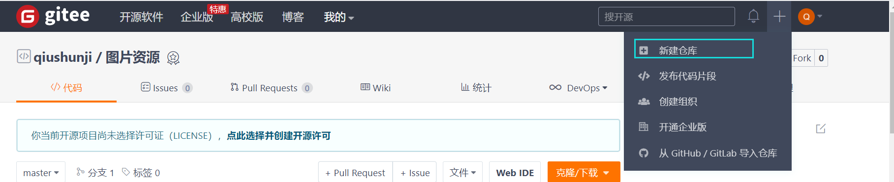
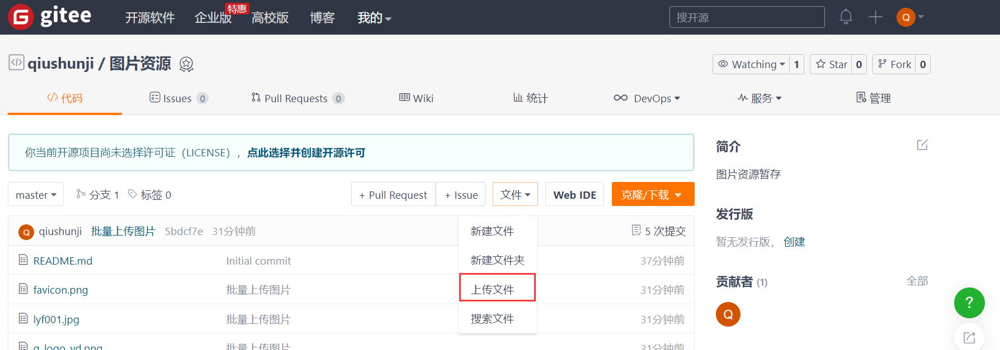

常常在写文章时候需要引用一些图片，而因为要追求原创，因此需要将自己的图片保存在方便访问的位置。基于这个需求，今天教大家如何集中存储和管理自己的图片。（当然说的是免费的啊）

<br>


### 一、利用Git仓库

[参考教程](https://blog.csdn.net/m0_49227651/article/details/108314030)

最常用的Git仓库当然是GitHub，但是它太慢了，我首先考虑的是国内的Gitee，官网是[www.gitee.com](www.gitee.com)。

第一步：注册登录（不解释）

第二步：新建仓库



<br>


第三步：上传文件



<br>


第四步：点击上传图片复制其链接：

```xml
https://gitee.com/qiushunji/src-images/blob/master/lyf001.jpg
```

<br>


第五步：修改地址：`blob`改为`raw`

```xml
https://gitee.com/qiushunji/src-images/raw/master/lyf001.jpg
```

<br>


### 二、利用博客网站

我们知道写博客的时候都有图片，如CSDN都会帮我们要引用的图片存储起来，那么萌生出一个坏坏的想法。为什么不把我需要保存的图像集中存储，记录链接，要用的时候复制链接来用呢！

说干就干！

第一步：注册登录（不解释）

第二步：编写文章


<br>


第三步：点击上传图片


<br>


第四步：提取和复制链接

上传后链接是这样子的：

```

```

<br>

我们要的链接：

```
https://img-blog.csdnimg.cn/20210507111853775.jpg
```

<br>

由于CSDN不能使用缩放，个人建议使用（缩放30%）：

```markdown

```

<br>

具体的样例请点击链接：[查看CSDN搭建的图床](https://blog.csdn.net/win_CSDN/article/details/116484475)

<br>

<hr>

*时间：2021-05-07*