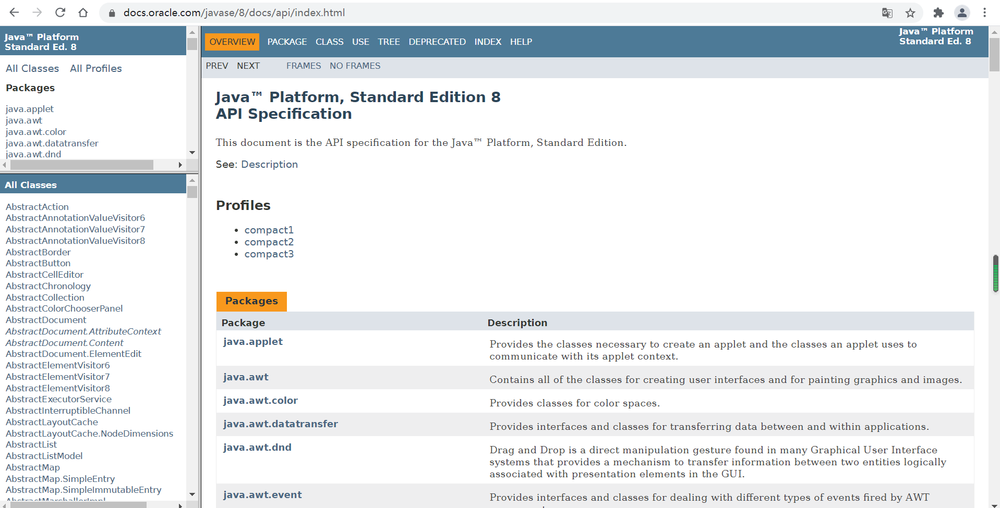

本人有志于JDK8的学习，从源码入手更加深入的理解Java代码，理解其中的数据结构及算法。作为目前使用最为广泛的语言之一，其源码涉及诸多先进的代码实现思想，如并发问题等，很多开源框架的基本思想都是来源于JDK或借鉴或一定程度的体现等。如Spring、MyBatis等。

本文主要讲述JDK文档的下载使用。

<br>


### JDK-API文档简介

JDK的API文档是每个Java开发者必须学会阅读的文档，更多Java信息可以在[官方网站](https://www.oracle.com/java/)上查阅，其中JDK8是其中的一个经典版本。api文档截图：



[JDK8在线API文档[oracle官网]](https://docs.oracle.com/javase/8/docs/api/index.html)

如果需要查看其他版本文档请查看链接：[其他版本文档](https://docs.oracle.com/en/java/javase/index.html)

<br>


### 资源下载

java所有相关文档：[CSND下载链接](https://download.csdn.net/download/win_CSDN/19143980)、[官方下载地址](https://www.oracle.com/java/technologies/javase-jdk8-doc-downloads.html)、[Gitee地址](https://gitee.com/qiushunji/jdk-8u291-docs-all)

java-API文档网页版：[CSND下载链接](https://download.csdn.net/download/win_CSDN/19144312)、[Gitee地址](https://gitee.com/qiushunji/jdk-8u291-docs-api)

java-API中文文档：[开源中国地址](https://tool.oschina.net/apidocs/apidoc?api=jdk-zh)

java-API文档windows版：[CSND下载链接](https://download.csdn.net/download/win_CSDN/19148185)

<br>


### 网页版使用介绍

如果你是为了资源整合，或相对API做些相应的修改（如添加注释等等），需要下载网页版的API文档，然后部署到自己的服务上，个性化的API文档将会让你觉得很酷（费事费力耍帅）

<br>

1、下载网页版API（**上文有链接**）

这里采用`git clone`

```bash
git clone https://gitee.com/qiushunji/jdk-8u291-docs-api.git
```

<br>

2、访问`index.html`

http://zayl.top/jdk-8u291-docs-api/api/index.html

如果是下载到压缩包的话，解压就行了。

<br>

<br>


参与网站部署使用的平台：`centos linux 7`

