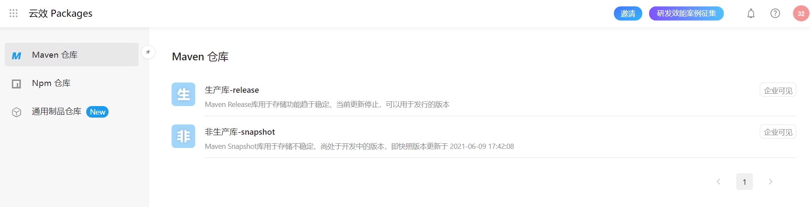
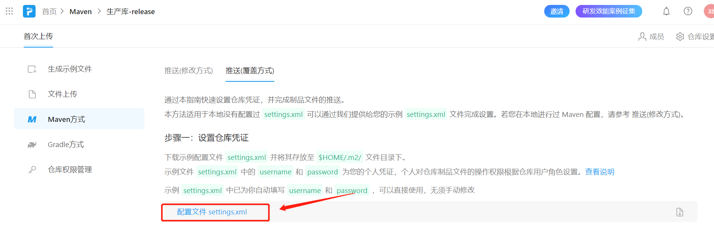
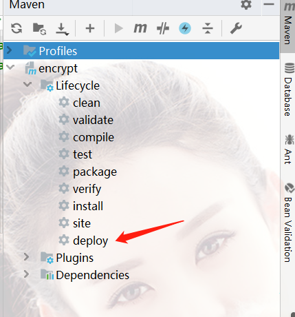
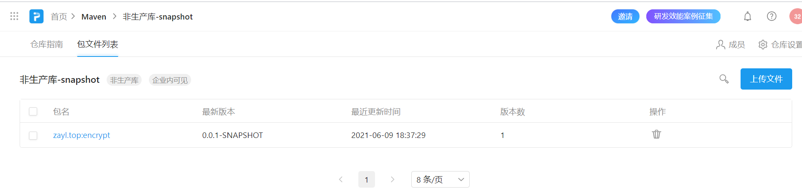

### 引言

最近遇到多Module实现的复杂项目，作为一个深受解耦思想的毒，什么都想“拆分”，因此有了一个话题，**程序打包**，一个程序想要安装运行，需要**数据+环境+程序**，程序模块拆分也是一个小的程序，这样的小程序我们通常叫做——**主程序的依赖**。今天就讲讲Java中的`Package`

<br>


### 一、项目背景

以最近的一个SpringBoot项目为例，需求是SpringBoot的web项目中，为了保证数据传输过程的安全性，因此需要对请求、响应做数据的加密。显然我以后经常要用到，为了方便使用，那么需要将其抽离出来，打包上传到Maven仓库，方便下次下载使用。对数据加密这块感兴趣，请看文章其他内容，私信我也行。

<br>


### 二、阿里云镜像仓库

官网提供很多公共的Maven仓库，可以直接使用，链接地址：[https://maven.aliyun.com/mvn/guide](https://maven.aliyun.com/mvn/guide)

#### 第一步：创建个人仓库

创建个人仓库：https://packages.aliyun.com/maven

点击链接，注册登录



默认有两个生产库，**正式版**和**快照版**

<br>

#### 第二步：配置Maven仓库



第一次使用需要配置推送配置，就是`settings.xml`，以前有使用过阿里云仓库下载的，并自定义了`settings.xml`请酌情修改，如果没有，那么直接复制到默认目录`{HOME}/.m2/`，我的配置目录为`C:\Users\lp\.m2\`。

##### 注：settings.xml有阿里仓库的用户名，密码，正式版**和**快照版的仓库地址等信息，完全不用做任何修改可直接使用。

<br>

### 三、项目打包部署

打开一个没有bug的项目，`pom.xml`添加配置：

```xml
<!-- 省略了其他依赖和配置-->
<project>
    
    <distributionManagement>
        <repository>
            <id>rdc-releases</id>
            <url>https://packages.aliyun.com/maven/repository/xxxxx/</url>
        </repository>

        <snapshotRepository>
            <id>rdc-snapshots</id>
            <url>https://packages.aliyun.com/maven/repository/xxxxx/</url>
        </snapshotRepository>

    </distributionManagement>
    
</project>
```

这分别表示，`release/snapshot`两个版本的配置，项目打包时自动根据`url`上传打包后的`.jar`文件，这个地址可以在`settings.xml`直接找到，也可以登录阿里云个人仓库中找到。

<br>

配置好没问题直接点击`depoly`



一堆打印后看到：Finished

```
Finished at: 2021-06-09T18:37:31+08:00
```

<br>


### 四、使用

在`pom.xml`中添加你的依赖：

```xml
<dependency>
    <groupId>zayl.top</groupId>
    <artifactId>encrypt</artifactId>
    <version>0.0.1-SNAPSHOT</version>
</dependency>
```

#### 注意：

我们知道Maven分为**本地仓库**和**远程仓库**，实际上上面依赖其实想找的本地仓库的，`depoly`创建了本地仓库文件，然后上传到阿里云仓库中，正常来说配置正确远程仓库也会有一个，一起来验证下：



确实有哦，我们还发现，它在**非生产库-snapshot**中，为什么不是在**release**中，取决于项目配置里的版本

```xml
<project>
    <groupId>zayl.top</groupId>
    <artifactId>encrypt</artifactId>
    <version>0.0.1-SNAPSHOT</version>
    <name>encrypt</name>
    <description>Encrypt and Decrypt of Spring Boot Project</description>
</project>
```

上面是我的配置：`0.0.1-SNAPSHOT`为版本号，有SNAPSHOT结尾的会上传到**快照版本库**中，反之**release**库中<br>


<mark>本文结束，如发现缺失，将不定时更新！</mark>