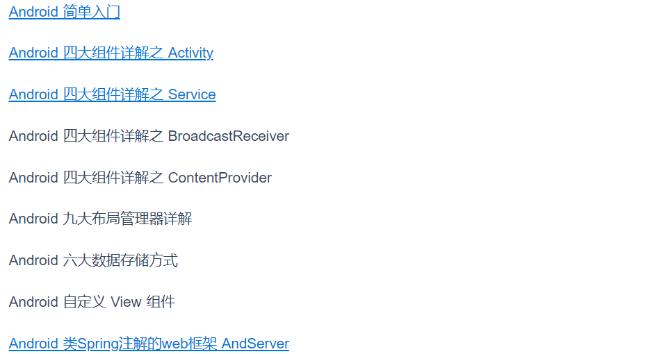
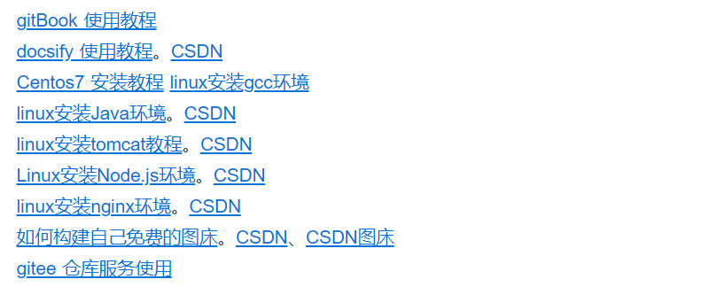

markdown是极为受宠的文档标记语言，极大提高开发者写文档的热情。我觉得很有必要来聊一聊这个话题，具体如何使用markdown。

<br>


## 语法

此处内容等待补充！

<br>


## 进阶

基本markdown语法有时候并不能满足一些特殊需求，本节讲述的方法可以结合基本语言，实现更加绚丽的显示，使得文档结构更清楚。

<br>

### HTML标签

<br>


### 换行

**1、中间空行**

```markdown
Android 九大布局管理器详解

Android 六大数据存储方式
```

显示效果是这样的：



<mark>这样显示两行文字距离略宽</mark>

<br>


**2、使用HTML标签**

文档支持`html`标记语言，`<br>`实现换行：

```html
<br>
<br/>
```

<br>


**3、段落后两个空格**

```xml
[Centos7 安装教程](introduction/centos7-install.md)  
[linux安装gcc环境](introduction/linux-install-gcc)  
```

后面是有两个空格符的



<mark>这样显示两行文字距离略窄</mark>

有空格的话，编辑器有个向下的**箭头**，实际上没有空的话有些会显示成这样：


